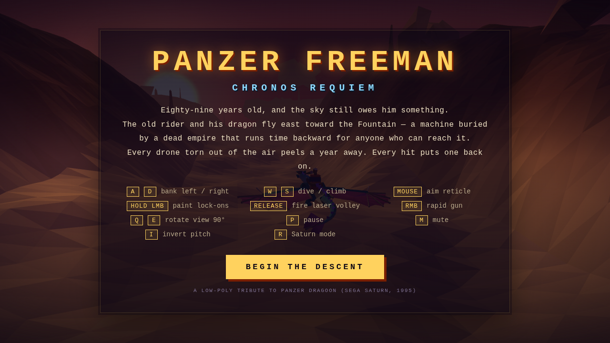
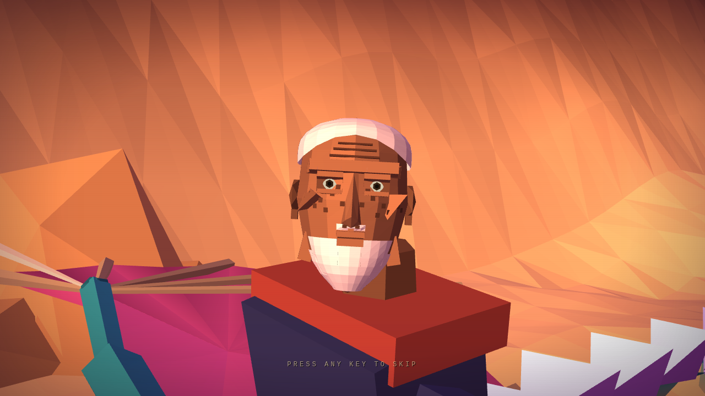
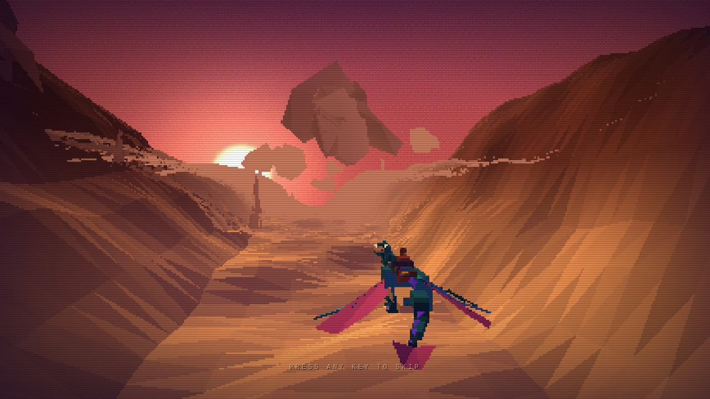
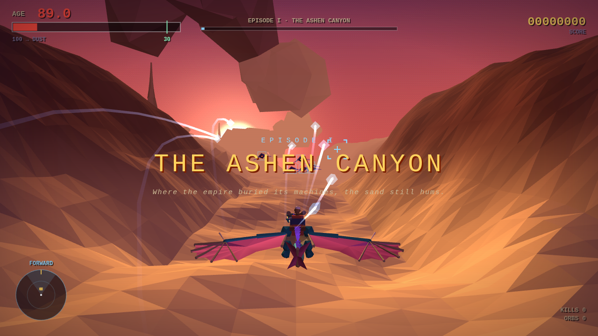
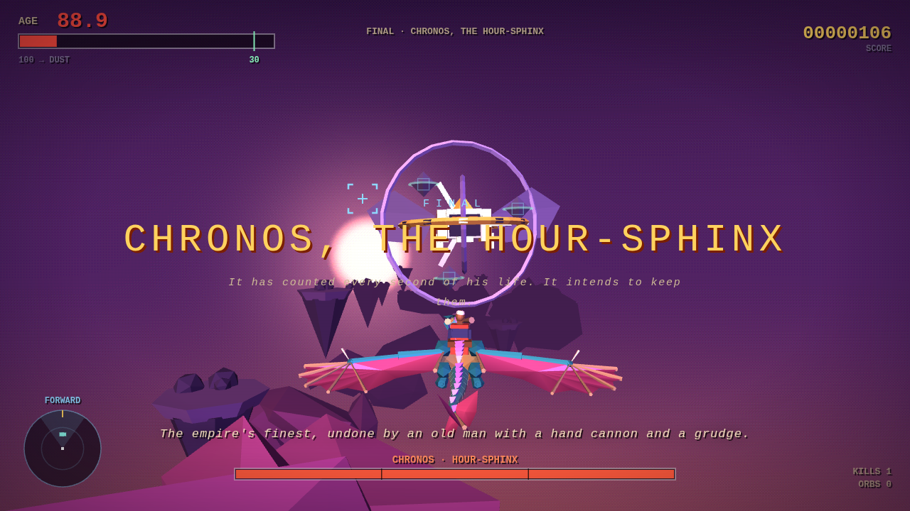
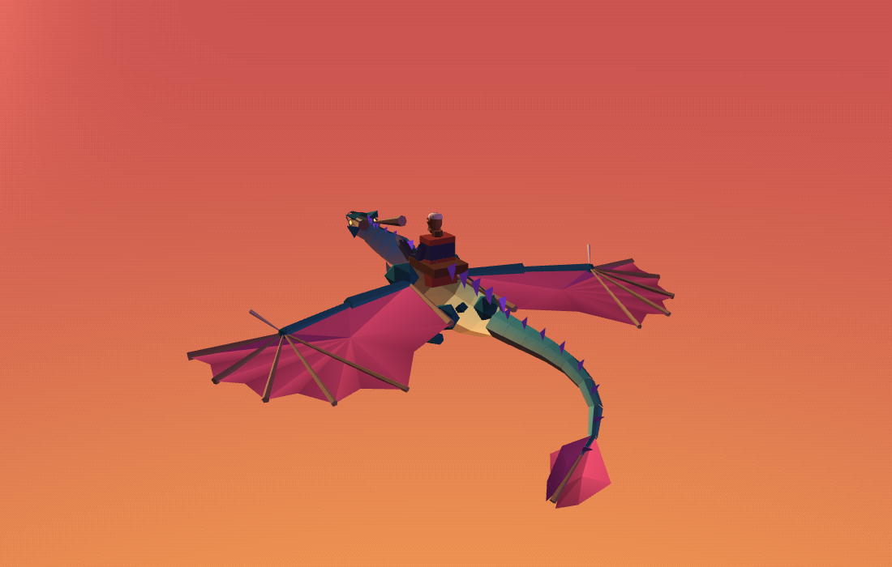

# PANZER FREEMAN — Chronos Requiem

A low-poly, Sega-Saturn-flavoured 3D rail shooter that runs in a single HTML file.
An eighty-nine-year-old man rides a dragon toward a machine that runs time backwards.
Defeating enemies gives him time back. Taking hits ages him.

**[▶ Play it](https://animagix77.github.io/panzer-freeman/)** · no install required.



---

## What it is

A tribute to **Panzer Dragoon** (Sega Saturn, 1995) — the rail flight, the four-way
view rotation, the sweep-to-paint lock-on volleys — drawn as clean low-poly rather
than as a Saturn emulation, with a soundtrack aimed squarely at **Lords of Thunder**
(PC Engine CD). The ~1.4 MB HTML bundle embeds Three.js, the rider model,
and procedural game systems. Six MP3 cues stream from `sound/`; effects use an
original Web Audio sample bank rendered at startup. Serve the folder over HTTP.

| | |
|---|---|
|  |  |
|  |  |



## Controls

| Key | Action |
|---|---|
| `A` `D` | bank left / right |
| `W` `S` | dive / climb (inverted by default) |
| Mouse | aim reticle |
| Hold LMB | sweep to paint lock-ons (up to 8) |
| Release LMB | fire the homing laser volley |
| RMB | rapid gun |
| `Shift` | boost; consumes wing power |
| `X` | air brake |
| `Space` + direction | evasive roll; costs 28 wing power, 1.4s cooldown |
| `Q` `E` | rotate the view 90° |
| `I` | toggle inverted pitch |
| `R` | toggle Saturn mode |
| `P` | pause · `M` mute |

## The interesting bits

**Four stages and a finale.** The wider Ashen Canyon divides around a central mesa;
blue rings reward either passage with score and wing power. The Drowned Choir has
crossing squadrons and an ambush. The new Ember Foundry adds a carrier convoy with a
three-year mission reward. The Citadel of Hours and final arena now have continuous
mountain terrain and keeps planted on deep foundations, with bridges between towers.
The foundry currently shares the canyon music cue.

**Flight choices.** Boost, air brake and evasive roll add speed control and a brief
evasion window. Boost and roll share a replenishing power reserve. Carriers take
double damage when attacked from more than 26 units to either side or 18 units above;
the HUD indicates when a core is exposed.

**Combat light.** Laser heads have soft cyan glow and bright tapered trails. Hits
flare, explosions throw hot fragments and expanding shockwaves, and three pooled
point lights illuminate nearby surfaces. Forty pooled glow bursts bound the cost.
Clouds use soft mist sprites instead of solid polygon lumps.

**A guided first minute.** An optional opening teaches sweeping lock-ons with
three non-firing targets worth one year each, shows the years actually earned,
then introduces a telegraphed shot and a carrier with escorts. The carrier holds
formation long enough to engage before a crossing patrol arrives. Press Enter
or use the briefing's skip button to join normal combat immediately. Guidance can
also be disabled on the title screen.

**Clean low-poly rendering.** Everything is drawn at display resolution with MSAA:
hard flat-shaded facets, a textured rider, and soft procedural glow textures. Skies are ordered-dithered
gradients — the dither is there to kill 8-bit banding, not to fake it. Terrain splits
each cell on an alternating diagonal so slopes face in a scattered mosaic instead of
developing long directional slivers. A whisper of scanline and a soft vignette are all
that's left of the CRT pass.

**Saturn mode is still in there.** Press `R` and the buffer drops to 232 lines
nearest-upscaled, the sky quantises to 15-bit, the full scanline/vignette pass comes
back, and every material starts snapping its vertices to a coarse clip-space grid —
the real 90s integer-math wobble, not a filter. The snap shader is always compiled in
and gated on a uniform, so the switch is instant and doesn't rebuild a single
material. The HUD is a separate full-res canvas, so it stays sharp either way.

**A dragon with a flight model.** Wingbeats are driven by an *effort* value derived
from actual vertical velocity, so climbing costs work and diving is free:

| | vertical speed | wingbeats |
|---|---|---|
| idle / level glide | 0 | 0.58/s — one every 1.7s |
| climbing | +45 | **3.70/s** — one every 0.3s |
| diving | −46 | **0.32/s** — one every 3.1s |

A flap takes a fixed ~0.4s however often it comes, so at low effort the dragon
holds an extended glide and flaps only occasionally, with jittered timing so idle
beats aren't metronomic. Climbing is 6.4× the idle rate and 12× the dive rate.

The beat is asymmetric — a fast powered downstroke, a slow recovery — and each
downstroke fires an impulse into a damped spring, so the body genuinely lifts and
settles. Gliding flattens and sweeps the wings back; climbing cups them forward.
Altitude trades for airspeed in both directions. The body banks into its turns,
pitches with its climb, and yaws so the nose leads — all three verified by
measuring the model's world orientation against the camera basis, because every
one of them was silently inverted at first.

**A tail that trails.** The tail isn't told about the turn. It's a chain of
spring joints, each of which keeps its own heading when the joint ahead of it
swings away, then springs back into line — so a turn sends a travelling wave down
it and the tip whips out behind. Two incommensurate sine pairs add a slow waver
that never quite repeats, freer toward the tip.

Movement poses follow actual travel in the dragon's frame, so changing the view
doesn't reverse its bank. Steering eases into the flight boundaries and the rig
settles into a glide when movement stops. Flaps finish before their timing changes,
wing folds ease through recovery, and the rider's brace stays consistent across
frame rates. The tail passes each joint's remaining rotation down the chain rather
than repeating the full turn at every joint.

**Panzer Dragoon lock-on.** Sweeping the reticle stacks locks (a big target soaks
several), and the volley launches in a wide fan before the homing tightens and curls
each bolt onto its target. Each bolt drags an additively-blended ribbon trail whose
anchors are laid down *by distance travelled*, so the streak is the same length at
30fps or 144.

**A recorded score, six cues deep.** One track per episode plus a title and a boss
theme, streamed from [`sound/`](sound/) and cross-faded on episode change. There is
no synth fallback behind them: the game either plays its score or runs on sound
effects alone. It used to open with a procedural chiptune band covering the gap
while the first mp3 buffered, which meant the one thing you always heard was the
one thing that wasn't the soundtrack.

The prompt pack the tracks were generated from — keys, tempo and section plans
measured against the game itself — is in [`ost/ELEVENLABS_PROMPTS.md`](ost/ELEVENLABS_PROMPTS.md).

Effects combine swept FM energy, filtered noise, bass resonance, impact transients,
and decaying chimes. Three reusable variants per effect avoid identical repeated
shots. Stereo placement, distance attenuation, a short reverb and a compressor
blend the layers. A 28-voice cap and per-effect rate limits control busy volleys.
These are original procedural effects, with no external sample licenses required.

## Building

The repo ships a prebuilt `index.html`. To rebuild from source:

```bash
npm install          # pulls three.js, which gets inlined into the output
node build.js        # concatenates src/ into index.html
```

`src/` is split into modules that share one namespace:

| File | Contents |
|---|---|
| `p1_core.js` | renderer, retro shader patch, sky, SFX synth and the streamed score |
| `p1b_audio.js` | layered effect bank, stereo mix, reverb and compression |
| `p2_models.js` | procedural dragon + rider + enemies + boss, and the flight model |
| `p3_world.js` | terrain chunking, prop fields, episode definitions |
| `p4_game.js` | player, projectiles, ribbons, impacts, enemies, boss AI |
| `p4b_opening.js` | guided opening and authored first encounter |
| `p4c_effects.js` | pooled glow, shockwaves and impact lights |
| `p4d_campaign.js` | boost/brake/roll, route gates and authored stage encounters |
| `p5_hud_loop.js` | HUD canvas, opening cinematic, input, main loop |

## Testing

The release gate runs production-code integration checks without a browser:
`npm run check:release`. It covers the opening, flight rig, maneuvers, authored
formations, route and convoy rewards, world foundations, FX bounds and audio buffers.
Visual review uses `tools/combat-preview.html` and `tools/motion-preview.html`.
The older Playwright tools below require their configured browser installation;
they are additional developer probes, not part of the release gate:

```bash
node tools/check-upgrade.js  # maneuvers, campaign, world, effects, audio (includes motion)
node tools/check-opening.js  # briefing lifecycle plus real laser/dodge collision checks
node tools/check-motion.js   # real dragon/rider rig, view directions, boundary settling, frame rates
node tools/e2e-play.js        # full playthrough, screenshots, console errors
node tools/e2e-endings.js     # pause, death and victory paths
node tools/check-controls.js  # strafe/pitch directions in all four view rotations
node tools/check-flight.js    # effort response to climb and dive, spring stability
node tools/check-orientation.js   # roll/pitch/yaw measured against the camera basis
node tools/check-flaprate.js  # real wingbeats per second of game time in each state
node tools/check-tail.js      # confirms the tail trails the turn instead of steering it
node tools/model-viewer.js    # isolated turntable renders of the dragon
node tools/check-lasers.js    # lock painting and volley behaviour
node tools/check-music.js     # per-stage track switching, and that no synth music remains
node tools/check-fixes.js     # regression probes for previously shipped defects
node tools/check-perf.js      # draw calls, triangles, sim cost under worst case
```

For visual motion review, serve the project locally and open
`tools/motion-preview.html`. It cycles through turns, climbs, dives and boundary
holds with side/front views, pause and half-speed playback.

## Notes

Unaffiliated fan work. *Panzer Dragoon* is Sega's and *Lords of Thunder* is Hudson's;
this borrows their ideas out of admiration, not their assets. The rider is a low-poly
parody character, and the narrator captions are written in-character rather than
presented as anyone's real words.

MIT licensed — see [LICENSE](LICENSE).
